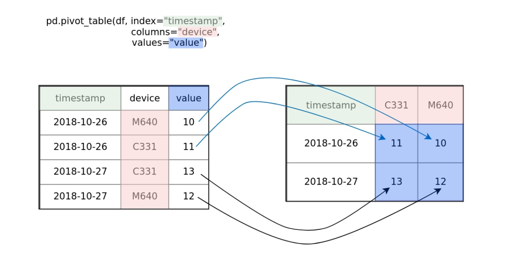

# Datacamp Course: Analyzing IoT Data in Python

These are my personal notes of the Datacamp course [Analyzing IoT Data in Python](https://app.datacamp.com/learn/courses/analyzing-iot-data-in-python).

Note that:

- Images are in [`pics`](pics).
- The code/exercises are in [`lab`](lab).
- The data is in [`data`](data).

Mikel Sagardia, 2023.  
No guarantees.

## Table of Contents

- [Datacamp Course: Analyzing IoT Data in Python](#datacamp-course-analyzing-iot-data-in-python)
  - [Table of Contents](#table-of-contents)
  - [0. Setup](#0-setup)
  - [1. Introduction to IOT Data: Accessing IoT Data](#1-introduction-to-iot-data-accessing-iot-data)
    - [1.1 Data Acquisition](#11-data-acquisition)
    - [1.2 Understanding the Data](#12-understanding-the-data)
    - [1.3 Introduction to Data Streams with MQTT](#13-introduction-to-data-streams-with-mqtt)
      - [Example: Publisher \& Subscriber via Test Mosquitto Broker](#example-publisher--subscriber-via-test-mosquitto-broker)
  - [2. Processing IoT Data](#2-processing-iot-data)
    - [2.1 Basic EDA and Cleaning: Temporal Plots and Histograms](#21-basic-eda-and-cleaning-temporal-plots-and-histograms)
    - [2.2 Missing Data](#22-missing-data)
    - [2.3 Gather Minimalistic Incremental Data](#23-gather-minimalistic-incremental-data)
    - [2.4 Prepare and Visualize Incremental Data: Pivoting and Diff](#24-prepare-and-visualize-incremental-data-pivoting-and-diff)
  - [3. Analyzing IoT Data](#3-analyzing-iot-data)
    - [3.1 Combining Datasources for Further Analysis](#31-combining-datasources-for-further-analysis)
      - [Example: Combine and Resample](#example-combine-and-resample)
    - [3.2 Correlation](#32-correlation)
    - [3.3 Outliers](#33-outliers)

## 0. Setup

You should create an environment (e.g., with [conda](https://docs.conda.io/en/latest/)) and install the necessary libraries/packages. A brief recipe for that:

```bash
# Create and activate e
conda create --name ds pip python=3.7
conda activate ds

# Install pip dependencies
pip install -r requirements.txt

# Track any changes and versions you have
pip list --format=freeze > requirements.txt
```

## 1. Introduction to IOT Data: Accessing IoT Data

IoT = Internet of Things: a network of connected devices sharing data from the environment; devices that collect data everywhere.

Common formats:

- JSON
- Plain text
- XML
- Binary
- Closed protocols

Data acquisition:

- Often IoT data is collected in data streams;
- Collected from devices;
- API endpoints.

### 1.1 Data Acquisition

Typical data acquisition with `requests` and `pandas`:

```python
import requests
import pandas as pd

# Option 1: Requests
url = "https://demo.datacamp.com/api/temp?count=3"
r = requests.get(url)
# Extract JSON
r.json()

# Convert JSON to pandas dataframe
df = pd.DataFrame(r.json()).head()

# Option 2: Handle download + conversion with pandas
url = "https://demo.datacamp.com/api/temp?count=3"
df_env = pd.read_json(url)
df_env.head()

# Pandas often takes care of data types, e.g., timestamps
print(df_env.dtypes)
```

To store the data:

```python
# JSON
df_env.to_json("data.json", orient="records")
# CSV
df_temp.to_csv("temperature.csv", index=False)
```

### 1.2 Understanding the Data

```python
import requests
import pandas as pd

DATA_PATH = "../data/"
filename = "environ_MS83200MS_nowind_3m-10min.json"

df = pd.read_json(DATA_PATH+filename)
df.head()

df.info()
df.describe()
```

### 1.3 Introduction to Data Streams with MQTT

Data streams are constant streams of data; e.g.:

- Twitter
- Video
- Sensor IoT data
- Market orders

The MQTT protocol can bee used to deal with them. MQTT = Message Queueing Telemetry Transport. It is used for machine-to-machine communication. Advantages:

- It has a nice **publisher/subscriber** architecture.
- It has a small footprint, it's lightweight.
- It's robust in environments with high latency and low bandwidth.

Concepts:

- There is a server, which is the **broker**; the broker **defines topics**, and any device can **publish to those topics**. Examples of topics: `temperature`, `position`.
- Any device, client, can **subscribe to a topic**.
- Also: **publisher = producer**, **subscriber = consumer**.

Installation of Paho-MQTT, the python library which implements the MQTT protocol:

```bash
python -m pip install paho-mqtt
```

Note for usage: in order to make use of MQTT, we need to set up a broker; we can either install one (e.g., [Eclipse Mosquitto](https://mosquitto.org)), or use available internet brokers created for test purposes:

- [mqtt-dashboard.com](http://www.mqtt-dashboard.com)
- [test.mosquitto.org](https://test.mosquitto.org)
- [iot.eclipse.org](https://iot.eclipse.org)

Interesting links: 

- [MQTT Beginners Guide](https://medium.com/python-point/mqtt-basics-with-python-examples-7c758e605d4).
- [Eclipse Mosquitto: An open source MQTT broker](https://mosquitto.org)

#### Example: Publisher & Subscriber via Test Mosquitto Broker

Source: [MQTT Beginners Guide](https://medium.com/python-point/mqtt-basics-with-python-examples-7c758e605d4); I modified the code.

In this example, 2 publisher scripts publish to a topic on a public broker; then, a subscriber reads from that topic. We need to run each script in a separate shell.

File [`mqtt_publisher_1.py`](./lab/mqtt_publisher_1.py):

```python
import time
import json
from random import uniform
import paho.mqtt.client as mqtt 

# Public broker: remove https://www.
#mqttBroker = "test.mosquitto.org"
mqttBroker = "mqtt.eclipseprojects.io"

# Create a client with a name
client = mqtt.Client("Temperature_Inside")
client.connect(mqttBroker) 

# Topic name: we can use any name we want, as long as it is free.
topic_name = "/mqtt/test/temperature"

while True:
    # Measure the value (or generate)
    rand_temp = uniform(20.0, 21.0)
    # Pack it
    packet = {"temperature": rand_temp, "location": "inside"}
    # PUBLISH to broker topic /mqtt/test/temperature
    # The broker creates the topic if not available
    client.publish(topic_name, json.dumps(packet))
    print(f"Just published {str(packet)} to topic {topic_name}")
    time.sleep(1) # 1 sec

```

File [`mqtt_publisher_2.py`](./lab/mqtt_publisher_2.py):

```python
import time
import json
from random import randrange
import paho.mqtt.client as mqtt

# Public broker: remove https://www.
#mqttBroker = "test.mosquitto.org"
mqttBroker = "mqtt.eclipseprojects.io"

# Create a client with a name
client = mqtt.Client("Temperature_Outside")
client.connect(mqttBroker)

# Topic name: we can use any name we want, as long as it is free.
topic_name = "/mqtt/test/temperature"

while True:
    # Measure the value (or generate)
    rand_temp = randrange(10)
    # Pack it
    packet = {"temperature": rand_temp, "location": "outside"}
    # PUBLISH to broker topic /mqtt/test/temperature
    # The broker creates the topic if not available
    client.publish(topic_name, json.dumps(packet))
    print(f"Just published {str(packet)} to topic {topic_name}")
    time.sleep(1) # 1 sec

```

File [`mqtt_subscribe.py`](./lab/mqtt_subscribe.py): Note that we can either (1) create a client which runs in a `loop` or (2) create a `callback`. For both cases, a function `on_message()` needs to be defined. This script reads the messages sent by the other two to the topic `/mqtt/test/temperature` hosted in the specified public broker.

```python
import time
import paho.mqtt.client as mqtt
import paho.mqtt.subscribe as subscribe

# We always need on_message with these arguments
# even if they are not used!
def on_message(client, userdata, message):
    # We simple print the message content here = message.payload
    # We can also access the topic name via message.topic
    print(f"Received message: {str(message.payload.decode('utf-8'))}")
    # To parse a JSON: data = json.loads(message.payload)
    # Then we would store it: store.append(data)
    # And finally as a dataframe outside from on_message:
    # df = pd.DataFrame(store)
    # df.to_csv("datastream.csv", index=False)

# Public broker: remove https://www.
#mqttBroker = "test.mosquitto.org"
mqttBroker = "mqtt.eclipseprojects.io"

# Topic name: the name should be the one used by the publishers
topic_name = "/mqtt/test/temperature"

## Option 1: Use a client and a loop
client = False
if client:
    client = mqtt.Client("Smartphone")
    client.connect(mqttBroker)

    # Loop
    client.loop_start()
    client.subscribe(topic_name)
    client.on_message = on_message
    # It means the loop stops after 30 sec!
    # Not that it waits 30 sec after reading once!
    time.sleep(30)
    client.loop_stop()

## Option 2: Use a callback
if not client:
    subscribe.callback(on_message,
                       topics=topic_name,
                       hostname=mqttBroker)

```

## 2. Processing IoT Data

The code shown in this section is located in [`lab/02_Process_IoT_Data.ipynb`](./lab/02_Process_IoT_Data.ipynb).

### 2.1 Basic EDA and Cleaning: Temporal Plots and Histograms

```python
import pandas as pd
import matplotlib.pyplot as plt

DATA_PATH = "../data/"
filename = "environ_MS83200MS_nowind_3m-10min.json"

df = pd.read_json(DATA_PATH+filename)

df.head()
df.info()

# Measure missing values: 50% of some column rows are NA
df.isna().sum()/df.shape[0]

# Create a line/temporal plot
# If we drop the NAs, but the temporal distances are not the same
# We can instead fill the NAs: ffill = hold last sample forward, bfill = back fill
#df[cols].dropna().plot(title="Environmental data", x="timestamp")
cols = ["temperature", "humidity", "pressure", "timestamp"]
df[cols].fillna(method='ffill').plot(title="Environmental data", x="timestamp")
# Label X-Axis
plt.xlabel("Time")

# Plot with 2 axes: curves are set together
df[cols].fillna(method='ffill').plot(title="Environmental data", secondary_y="pressure", x="timestamp")
# Label X-Axis
plt.xlabel("Time")

# Create a histogram
cols = ["temperature", "humidity", "pressure", "radiation"]
df[cols].hist(bins=30, figsize=(10,10))
plt.ylabel("Frequency")

```

### 2.2 Missing Data

We can deal with missing data as follows:

- `dropna()`: drop, if few rows.
- `fillna(method='ffill')`: forward/backward fill, if few rows.

In any case, we need to measure the amount of NAs: `df.isna().sum()`.

Additionally, we need to check whether there is a longer connected period in which we don't have data; we can do that with `resample()`.

```python
# To use resample, the index needs to be a datetime column
df.set_index("timestamp", inplace=True)

# Calculate and print the sum of NA values
print(df.isna().sum())

# Resample data
df_res = df.resample("10min").last()

# Calculate and print NA count
# Temperature seems to have a larger amount of NAs, but it's OK
print(df_res.isna().sum())

# Plot to visualize if there is any gap
df_res[['pressure', 'temperature']].plot(title="Environment")
```

### 2.3 Gather Minimalistic Incremental Data

Since we are working with data streams, it is not possible to keep all the data in memory. Because of that, we do **caching**: we store the incoming messages in a cache and save it to disk when a size is reached.

Additionally, it is fundamental to save the timestamp of each message; the timestamp should be as close as possible to the measurement instant. If the message/mesaurement has no timestamp, we can use the publish timestamp, prvided by `mqtt`.

Sometimes the timestamps are ini Unix time. Pandas can reparse them with `to_datetime`.

```python
import datetime
import pandas as pd
import paho.mqtt.subscribe as subscribe

cache = []
MAX_CACHE = 256
def on_message(client, userdata, message):
    data = json.loads(message.payload)
    # If data has no timestamp, save the publish time from mqtt
    publish_time = message.timestamp
    consume_time = datetime.utcnow()
    data['timestamp'] = publish_time
    data['consume_time'] = publish_time    
    cache.append(data)
    if len(cache) > MAX_CACHE:
        # Open file in append mode!
        with open('data.txt', 'a') as f:
            f.writelines(cache)
           # Reset cache
        cache.clear()
        
# Connect function to mqtt datastream
subscribe.callback(on_message,
                   topics="datacamp/energy",
                   hostname=MQTT_HOST)

# Translate timestamp from Unix/other format to datetime
df["timestamp"] = pd.to_datetime(df["timestamp"], unit="ms")
```

### 2.4 Prepare and Visualize Incremental Data: Pivoting and Diff

Since we can have different devices publishing to a topic, we might get a dataset with values measured by each device. It is difficult to interpret that; instead, we can pivot the dataframe to have a column for each device:

```python
data.head()
# timestamp device value

data = pd.pivot_table(data, columns="device", values="value", index="timestamp")
# timestamp device-1 device-2

# That will introduce many NAs, because the timestamps don't coincide
# To address that, we can resample DataFrame to 1min and take the max in the bin
df = data.resample("1min").max().dropna()
```



When the data is incremental, it makes sense to plot it with `diff()` and `pct_change()` to check the differences from timestamp to timestamp.

```python
df_diff = data.diff(1)
df_diff.plot()

df_pct = df_diff.pct_change()
df_pct.plot()
```

## 3. Analyzing IoT Data

The code shown in this section is located in [`lab/02_Process_IoT_Data.ipynb`](./lab/02_Process_IoT_Data.ipynb).

### 3.1 Combining Datasources for Further Analysis

It is common to get to datasets with a time series of a measurement. We can merge them with `concat`:

```python
import pandas as pd

# axis = 1 concatenates columns one next to the other,
# axis = 0 would append rows one after the other
environ = pd.concat([temp, sun], axis=1)
```

Since that might introoduce many NA values, we can resample it. Note that we can use different aggregated functions for each column:

```python

# It makes sense to pick the maximum temp in a bin
# and the sum of radiation in the bin
agg_dict = {"temperature": "max", "sunshine": "sum"}
env1h = environ.resample("1h").agg(agg_dict)

# Another option is to fill the NAs with the last sample
env30min = environ.fillna(method="ffill")
```

#### Example: Combine and Resample

```python
import pandas as pd
import matplotlib.pyplot as plt

DATA_PATH = "../data/"
filename_light = "traffic_raw_siemens_light-veh.json"
filename_heavy = "traffic_raw_siemens_heavy-veh.json"
filename_environ = "environ_MS83200MS_nowind_3m-10min.json"

# Number of heavy vehicles like lorries or busses per hour on a road of a small city.
# Frequency: every 15 mins
light_veh = pd.read_json(DATA_PATH+filename_light)

# 8732 entries
light_veh.shape # (8732, 2)

light_veh.set_index('timestamp', inplace=True)
light_veh.columns = ['light_veh']

# Number of light vehicles, like automobiles or motorbikes per hour on that road.
# Frequency: every 15 mins
heavy_veh = pd.read_json(DATA_PATH+filename_heavy)

# 8732 entries, same as light_veh
heavy_veh.shape # (8732, 2)

heavy_veh.set_index('timestamp', inplace=True)
heavy_veh.columns = ['heavy_veh']

traffic = pd.concat([light_veh, heavy_veh], axis=1)

# Environmental data: precipitation, humidity, radiation, sunshine, pressure, temperature
# Frequency: every 5 mins
environ = pd.read_json(DATA_PATH+filename_environ)

environ.shape # (26175, 7)

environ.set_index('timestamp', inplace=True)
environ_traffic = pd.concat([environ, traffic], axis=1)

# There are many NAs because of the miss-match in the timestamp & frequency
environ_traffic.head()

# Create agg logic
agg_dict = {"temperature": "max", 
            "humidity": "max",
            "sunshine": "sum",
            "light_veh": "sum",
            "heavy_veh": "sum",
            }

# Resample the DataFrame 
environ_traffic_resampled = environ_traffic.resample("1h").agg(agg_dict)
# timestamp           temperature	humidity	sunshine	light_veh	heavy_veh
# 2018-09-01 00:00:00	16.1	      95.6	    3596.6	  0.0	      0.0
# ...
```

### 3.2 Correlation

Always check correlations with `sns.heatmap()` and `sns.pairplot()`. If two variables are very correlated, think of (1) merging them or (2) removing one. In this case, the number of heaviy and light vehicles are correlated. 

```python
import seaborn as sns

df = environ_traffic_resampled.copy()

# Always check correlations with heatmap and pairplot
# If two variables are very correlated, think of
# (1) merging them or (2) removing one
# In this case, tghe number of heaviy and light vehicles
# are correlated
sns.heatmap(df.corr(), annot=True)

sns.pairplot(df)

```

### 3.3 Outliers

