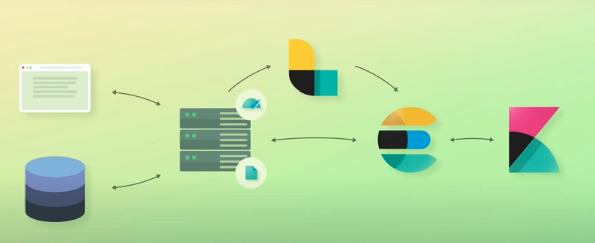
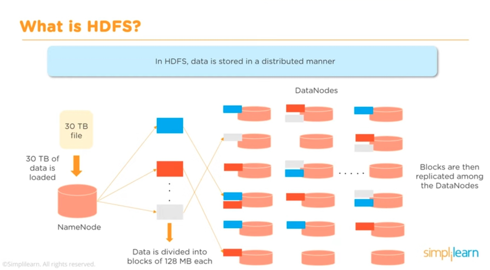
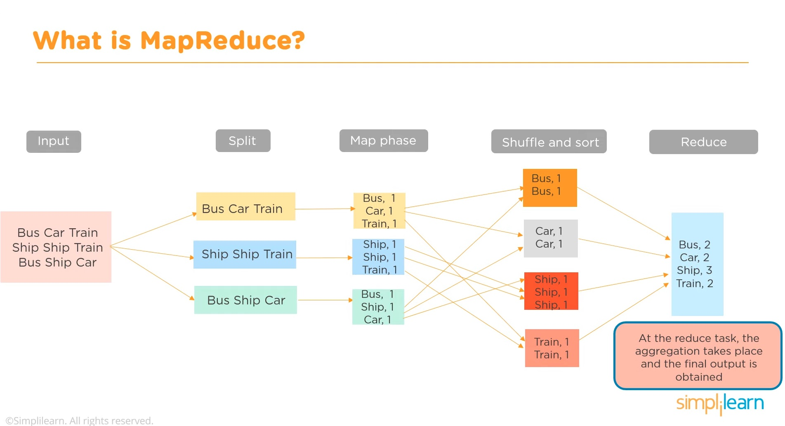

# Introduction to PySpark

## Introduction to Big Data Technologies: Elastic Search, Hadoop, Spark

Videos:

- [Introduction to Elasticsearch](https://www.youtube.com/watch?v=yZJfsUOHJjg&list=TLPQMDMwNDIwMjMUzpZmknQQfA&index=1)
- [Common Elastic Stack & Elasticsearch Architectures](https://www.youtube.com/watch?v=Yc-G13lEbpc&list=TLPQMDMwNDIwMjMUzpZmknQQfA&index=2)
- [Elasticsearch Tutorial for Beginners](https://www.youtube.com/watch?v=C3tlMqaNSaI&list=TLPQMDMwNDIwMjMUzpZmknQQfA&index=3)
- [What Is Hadoop? | Introduction To Hadoop | Hadoop Tutorial For Beginners | Simplilearn](https://www.youtube.com/watch?v=iANBytZ26MI)
- [Apache Spark Tutorial | What Is Apache Spark? | Introduction To Apache Spark | Simplilearn](https://www.youtube.com/watch?v=znBa13Earms)

Links:

- [What do you need to know about 𝗦𝗽𝗮𝗿𝗸 𝗔𝗿𝗰𝗵𝗶𝘁𝗲𝗰𝘁𝘂𝗿𝗲 as a Data Engineer?](https://twitter.com/i/web/status/1645709184501948416)

### Elastic Search

Elastic Search is a search engine which is able to find information faster than regular databases; additionally it's decentralized and it works with NoSQL data, i.e., using JSON documents. The queries can be also sent as JSON objects, too.

Elastic search is well integrated with other tools, aka. the *elastic search stack*:

- Kibana: visualization of data in elastic search.
- Metricbeat: node usage data, related to CPU, memory, etc.
- Filebeat: logs collected, parsed, structured and fed to elastic search.
- Logstash: event-based logs that need to be centralized.
- X-Pack (not free): security, monitoring, machine learning, graph exploration.

Usually, we need to have a database (e.g., a relational/SQL database) which contains information of our application, e.g., products we sell on an online store. Then, the data in the SQL database needs to be **copied** to elastic search; thus, we replicate the data! This is done that way because elastic search 

- is much faster for searching (e.g., when users search for products),
- it enables complex search interactions (i.e., completion, correction, suggestion, etc.) as Google,
- it should be used only for reading data.

More notes:

- Elastic search is more a stack with the aforementioned components in which *elastic search* itself is one component.
- Elastic search is implemented with Apache Lucene, which is an open source search engine.
- In contrast to Lucene, elastic search is horizontally scalable.
- You can do machine learning with elastic search.
- Sometimes, Spark/Hadoop require hours, while Elastic Search needs only milliseconds!
- For the user, elastic search is just a server which accepts JSONs and returns JSONs.
- On top of Elastic Search sits Kibana, which is a web UI for visualizing the data.
    - Kibana is often used to aggregate data.
    - We can du log analytics.

Elastic search structure concepts:

- Queries can be:
    - in JSON, using the RESTful API of the elastic search server,
    - using an API, i.e., a library for our language, e.g., Python.
- Information is stored as JSON documents, which are organized as follows:
    - JSON documents have an id and a type (schema: structure definition)
    - Index: they contain inverted indices which power the search
        - All searchable terms (tokens) are listed
        - For each term, the document ids are stored
        - Each term has also a TFIDF value to account for the relevancy
        - Thus, if we search for a term, the index is accessed looking for the documents that contain the term and the results are delivered according to relevancy

How does elastic search scale?

- Clusters of nodes are defined; each node can be on a computer/server/machine and contains an instance of Lucene, i.e., a search engine with JSON documents. Each of these Lucene instances is called a **shard**.
- When we create a document, it is hashed and directed to a given shard; a hash table keeps document and shard mappings.
- Each shard has its own index/indices; thus, when we search, all shards start looking in their index tables.
- There are primary and replica shards to increase resiliency and robustness, in case one node fails.
    - Primary and replica shards are scattered in different nodes; the primary shard is the original, the replicas are copies, but the all contain all the documents and the index tables.
    - Every time we append a document to a shard (write), that's appended to the primary shard, its index is updated, and the shard is replicated to the replicas spread in the cluster.
    - If we look for a term (read), any primary/replica shard can be used.

### Hadoop

Motivation:

- In the 1990's, we had structured data stored in a unique place.
- Now, we have structured / semi-structured / unstructured data stored in different places, because it's not possible to store everything in one place (due to high volume): parallel processing with distributed storage. Hadoop is a file system to achieve that way of working.

What is Big Data?

- Massive amount of data which cannot be stored, processed, and analyzed using the traditional ways.
- Typical properties of big data, 5Vs:
    - Volume: large
    - Velocity: fast
    - Variety of data
    - Value: data has a significant value
    - Veracity: data has uncertainty and processing is needed; e.g., tweets have abbreviations, etc.
- So, essentially, if you need more resources than what a computer could provide, you're dealing with Big data.

Challenges of Big data:

- Distributed storages
- Parallel processing
- Ability of processing every type of data, also unstructured.

Hadoop is a solution for these challenges. Components of Hadoop:

- Hadoop HDFS: Hadoop File System, for storage, distributed.
- Hadoop MapReduce: Processing of data.
- Hadoop Yarn: Resource management.

#### Hadoop HDFS

File system for huge distributed storage which runs on commodity hardware.

Two components:

1. NameNode: only one; the master node, usually a high-end computer.
    - They control the slave DataNodes.
    - They don't store the data, but the metadata.
2. DataNode: multiple DataNodes, distributed; the slave nodes, usually not the high-end computers.
    - They store the data.
    - They communicate with their master NameNode to report their status regularly.
    - Actions: read and write data, replicate, process, etc.
    - there are usually many DataNodes.

If we upload a 30 TB file/data to Hadoop, it goes to the NameNode, which chops it into chunks and stores the chunks in different DataNodes. Additionally, the chunks are replicated (by default, 3x) in different DataNodes to achieve resiliency and robustness (in case a DataNode goes down).

#### Hadoop MapReduce

MapReduce is a programming technique where huge data is processed in a parallel and distributed fashion.

- In traditional computing, the master would process the data; with MapReduce, the processing is done in the slave nodes and the result is sent to the master node.
- Steps for processing:
    - Data is split
    - Map: we re-structure the data as key-value mappings; the key is the data, the value is an aggregate value we want to find, e.g., count.
    - Shuffle and sort: ?
    - Reduce: key-value pairs are reduced to an aggregate value.

#### Hadoop Yarn

Yarn = Yet Another Resource Negotiator. It is like an OS for Hadoop:

- Resources are allocated: RAM and CPU of containers, etc.
- Job scheduling.

### Spark

A solution to store and process distributed data. Open source, programmed in Scala but with many bindings, e.g., PySpark.

#### Hadoop vs. Spark

- Spark is 100x faster than Hadoop MapReduce, because the processing is done in memory.
- Hadoop performs batch processing, while Spark can perform both batch and realtime processing; realtime: process data as it comes in.

#### Spark Features and Components

- Fast processing: Resilient Distributed Datasets (RDDs) are processed in-memory.
- In-memory computing: RAM can be used for persistence!
- Fault-tolerance.
- Analytics: SQL, ML, etc.

Components:

- Spark Core: handling of Resilient Distributed Datasets (RDDs).
- Spark SQL: for structured data.
- Spark Streaming: for streamed data, which can be processed as it comes in.
- Spark MLlib: low level ML library.
- Spark GraphX: for network related data, like social networks, etc; we can do graph-based processing.

#### Spark Core

Spark doesn't have a storage system, but in relies on existing file storage systems, e.g., HDFS (Hadoop).

We have two types of operations:

1. Transformations: `map`, `filter`, `join`, `union`
2. Actions: `reduce`, `first`, `count`

With any *transformation* operation, an RDD (Resilient Distributed Datasets) is created; RDDs are stored in a DAG (direct acyclic graph), but not executed/processed. If we want to execute/process the operations defined on the generated RDDs, we need to use an *action* operation.

#### Spark SQL

With structured data, we should use Spark SQL, which employs the DataFrame API. That API enables data frames (tables)

#### Spark Streaming

Realtime processing happens when streamed data is treated, e.g., tweets. The input stream is chopped in batches and the Spark engine is used to process it.

#### Spark Architecture

Spark can work stand-alone or with Hadoop Yarn. It uses the master/slave architecture.

We have:

- A **master node**, which has the **driver program**, and within it sits the **SparkContext**. We always have and interact with the Spark context.
- The Spark context talks to the **cluster manager**, which is outside from the **master node**. That manager can be, for instance Yarn and it takes care of the resource distribution.
- The **cluster manager** handles the **worker nodes**, which are independent from the manager and are usually distributed. It requests containers with certain capacities within them depending on the workload.

Possible cluster managers:

- Stand-alone, i.e., Spark itself.
- Apache Mesos.
- Hadoop Yarn.
- Kubernetes.

